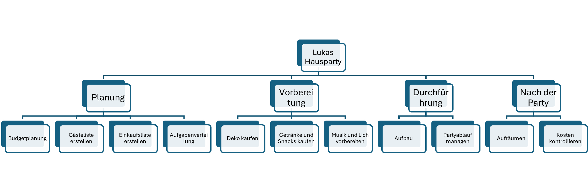
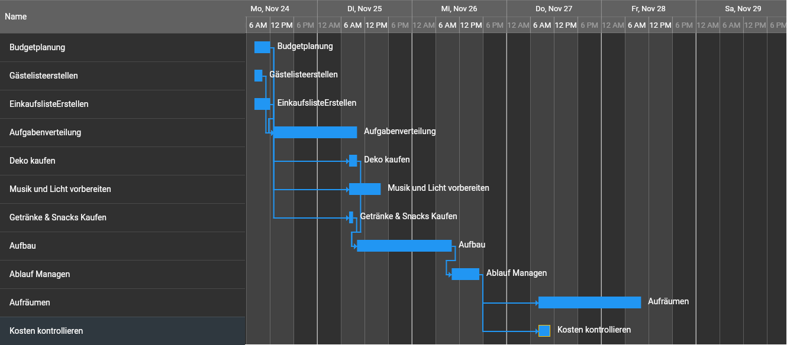

Definition

Unsere Gruppe plant eine Halloween-Hausparty bei Lukas Hairer, die am 31. Oktober stattfinden soll. Ziel des Projekts ist es, eine tolle oganisierte Veranstaltung für Freunde zu gestalten. Dabei sollen Musik, Beleuchtung, Kostüme und Verpflegung thematisch auf Halloween abgestimmt sein.

Zielsetzung

Wir möchten eine erfolgreiche Halloween-Party durchführen, bei der mindestens 25 Gäste teilnehmen, die Veranstaltung reibungslos abläuft. Dafür sollen Budget, Zeit und Ressourcen klar geplant werden. Die Partyvorbereitung wird innerhalb von zwei Wochen abgeschlossen, das Event findet am 31. Oktober um 19 Uhr statt und endet um Mitternacht. Das Projekt gilt als erfolgreich, wenn Ablauf, Stimmung und Organisation von über der Hälfte der Gäste positiv bewertet werden.

Projektorganisation

Projektauftraggeber: Lukas Hairer (stellt Haus und Budget bereit)

Projektleiter: Mark Tall (verantwortlich für Planung, Zeitmanagement und Kommunikation)

Projektmitarbeiter: Björn Kuffer, Sven Kuffer

Kunde: Die eingeladenen Gäste

Wir verwendet eine Matrix-Projektorganisation, weil dadurch jede Person eigene Aufgabenbereiche hat aber auch andere Dinge übernehmen kann, falls es Notwendig ist.

### Strukturplan

  

###  Ablaufplan - GRANNT - Diagramm

