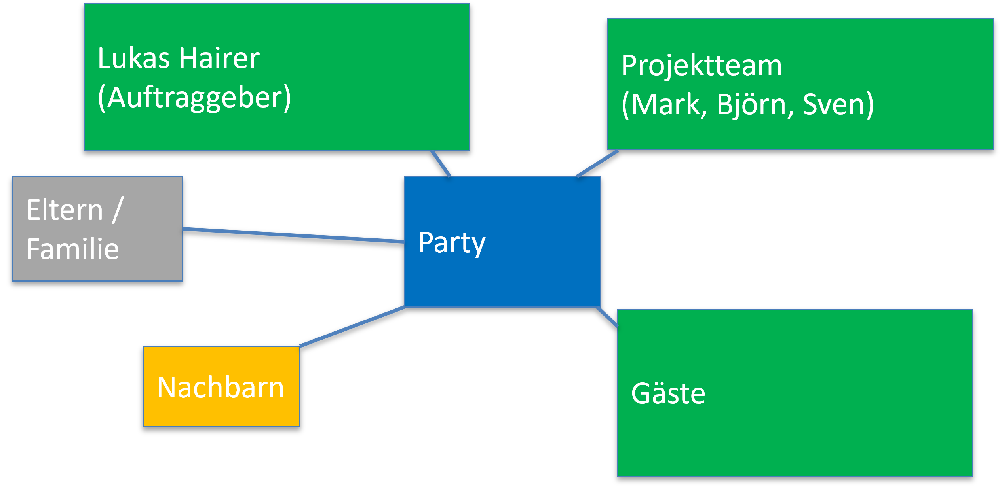
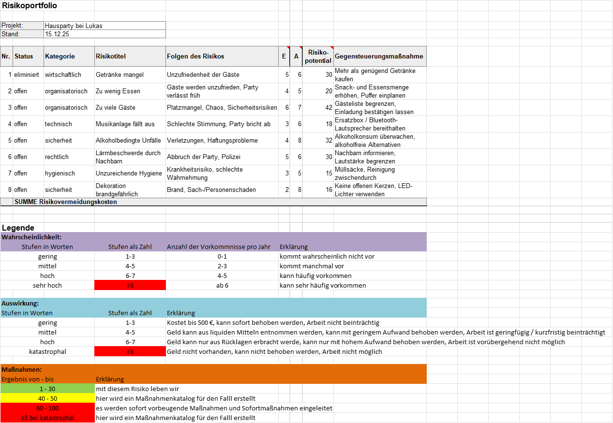
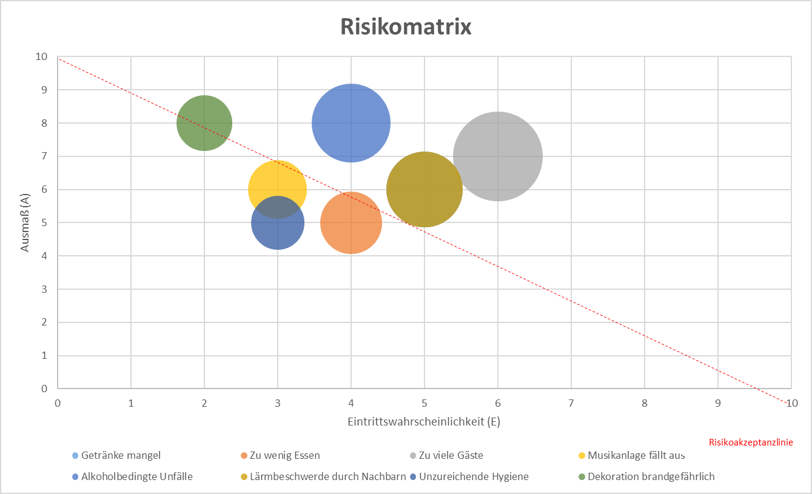

# Halloween-Hausparty – Projektplanung

## Definition
Unsere Gruppe plant eine Halloween-Hausparty bei **Lukas Hairer**, die am **31. Oktober** stattfinden soll.  
Ziel des Projekts ist es, eine **toll organisierte Veranstaltung** für Freunde zu gestalten. Dabei sollen **Musik, Beleuchtung, Kostüme und Verpflegung** thematisch auf Halloween abgestimmt sein.

## Zielsetzung
Wir möchten eine **erfolgreiche Halloween-Party** durchführen, bei der mindestens **25 Gäste** teilnehmen und die Veranstaltung **reibungslos abläuft**.

**Rahmenbedingungen:**
- Budget, Zeit und Ressourcen sollen klar geplant werden.
- Die Partyvorbereitung wird innerhalb von **zwei Wochen** abgeschlossen.
- Das Event findet am **31. Oktober um 19 Uhr** statt und endet um **Mitternacht**.
- Das Projekt gilt als erfolgreich, wenn **Ablauf, Stimmung und Organisation** von über der Hälfte der Gäste positiv bewertet werden.

## Projektorganisation

| Rolle                 | Name         | Aufgabe                                                                 |
|-----------------------|-------------|-------------------------------------------------------------------------|
| Projektauftraggeber    | Lukas Hairer | Stellt Haus und Budget bereit                                             |
| Projektleiter          | Mark Tall   | Verantwortlich für Planung, Zeitmanagement und Kommunikation            |
| Projektmitarbeiter     | Björn Kuffer, Sven Kuffer | Unterstützung bei Planung und Durchführung                     |
| Kunde                  | Gäste       | Die eingeladenen Gäste                                                   |

> Wir verwenden eine **Matrix-Projektorganisation**, da dadurch jede Person eigene Aufgabenbereiche hat, aber auch andere Aufgaben übernehmen kann, falls notwendig.

## Strukturplan
  

## Ablaufplan – GANTT-Diagramm
  

## Projektumfeldanalyse
  

  

## Risikoanalyse

  

